# Scenario Manipulator
### Instruction
Build a scenario using the simulator and save it as [`scenario.JSON`](scenario.JSON). You can see an example of such file [here](scenario.JSON). The important fields in the json file is described [here](InputExample.JSON)

- place the simulator (Deccq_VX.0.a.b) in the root directory. (tested on V3.0.0.5)
- place the `scenario.JSON` beside `scenariogenerator.py`
- install python dependencies (see `requirements.txt`) 
- run `python scenariogenerator.py` to generate scenarios
- make sure that there is no issue and output folders and files are created inside `results` directory
- Place a check to ensure that noise value is in the correct range

```
│ Scenario.json
│
│ ScenarioGenerator (vectorize)
│
│ ┌──────────┐    ┌─────────────────┐        Berge Simularor
└─► Vector_1 │    │ Scenario_1.json ├─────────┬───────────────┐
  │ Vector_2 │    │ Scenario_2.json │         │               │
  │ ...      ├────► ...             │         │               │
  │ Vector_n │    │ Scenario_n.json │         │               │
  │          │    │                 │         │               │
  └──────────┘    └─────────────────┘         │               │
     │      ScenarioGenerator (mutate)        │               │
     │                                        │               │
     │                                        │               │
     │             ┌──────────────────────────▼──┐    ┌───────▼────────────────────────────────┐
     │             │ Scenario_1/Normal/img_1.png │    │ Scenario_1/PlateSegmentation/img_1.png │
     │             │ Scenario_1/Normal/img_2.png │    │ Scenario_1/PlateSegmentation/img_2.png │
     │             │ ...                         │    │ ...                                    │
     │             │ Scenario_1/Normal/img_m.png │    │ Scenario_1/PlateSegmentation/img_m.png │
     │             └─────────────┬───────────────┘    └───────────────────────┬────────────────┘
     │                           │                                            │
     │   ScenarioGenerator (CAMEA│LP detector)                                │
     │                           │                                            │
     │           ┌───────────────▼─────────────────┐       ScenarioGenerator  │
     │           │ Scenario_1/Annotation/img_1.png │       (metric)           │
     │           │ Scenario_1/Annotation/img_2.png ├──────────────┐ Distance  │
     │           │ ...                             │              │ -IoU      │
     │           │ Scenario_1/Annotation/img_m.png │              │ -Accuracy │
     │           └─────────────────────────────────┘              │ -Confid   |
     │                                                            │           │
     │                                                  ┌─────────▼───────────▼───────────────┐
     │                                                  │ Scenario_1/Annotation/result_1.json │
     │                                                  │ Scenario_1/Annotation/result_2.json │
     │                                                  │ ...                                 │
     │                                                  │ Scenario_1/Annotation/result_m.json │
     │                                                  └─────────────┬───────────────────────┘
     │                                                                │
     └─────────────────────────────────────────────────────────┐      │
                                                               │      │
                                                     ┌─────────▼──────▼───────────────┐
                                                     │                                │
                                                     │   Linear Regression (weights)  │
                                                     │            Model               │
                                                     │                                │
                                                     └────────────────────────────────┘                                                
```

vector_i determines the noise on parameter_i (lighting, time, paths and trajectories, etc).
Vectors are normalised values (-1, +1) and results are a numerical value (can be normalised). Normalised "Vectors" and the "Results" are then used to train a linear regression model to find the effect of each parameter  

To calcualte the image distance we use IOU (intersection over union) method. Additionally we use score and confidence level that we get directly from LP detection servcice


### Sensors
The BERGE simulator offers a diverse set of sensor models, including cameras, cameras with distorted outputs, depth sensors, radars, and semantic segmentation sensors 

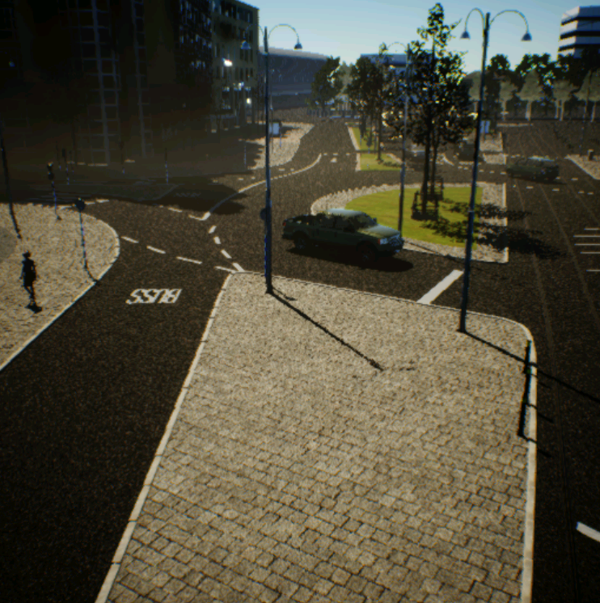
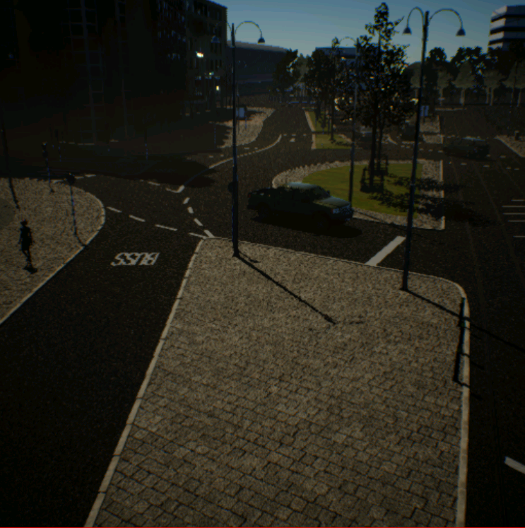
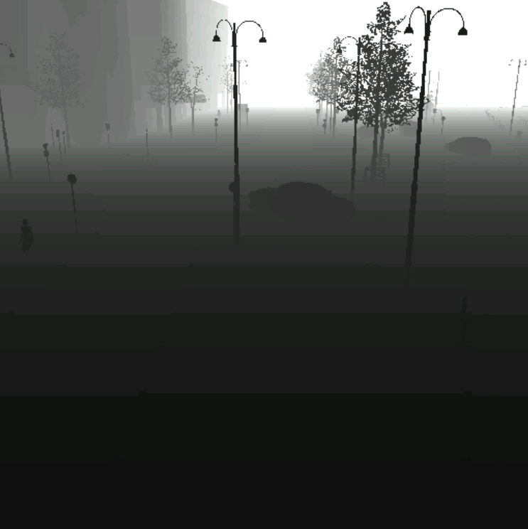
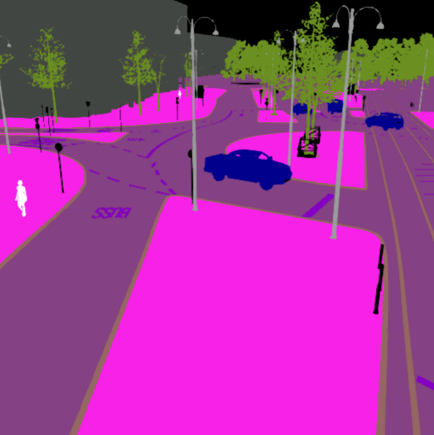

### semantic segmentation
Semantic segmentation of a scene in BERGE simulator

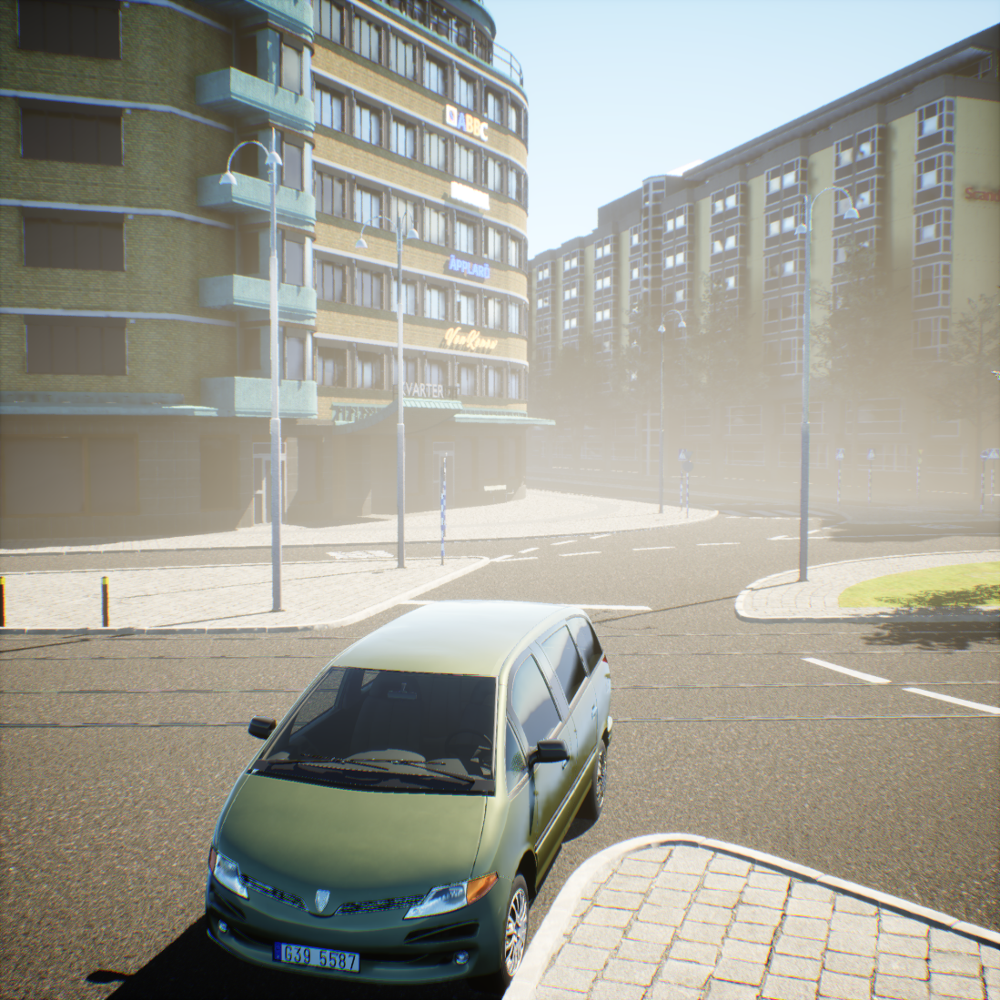
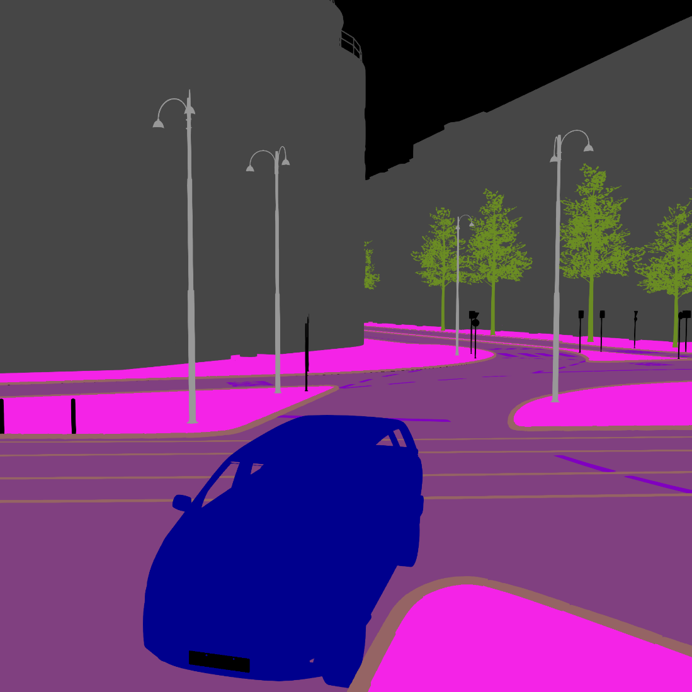

### LP detection
Semantic segmentation by BERGE simulator and bounding box detection by Unicam LP detection

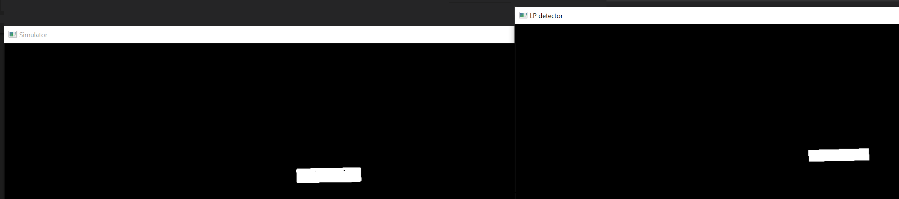

### Different weathers and time, evening, sunny, snowy, rainy
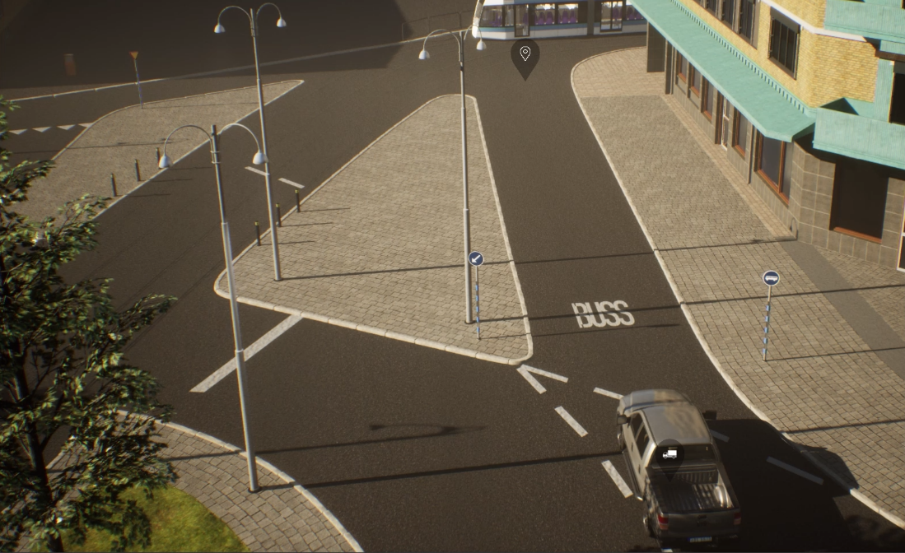
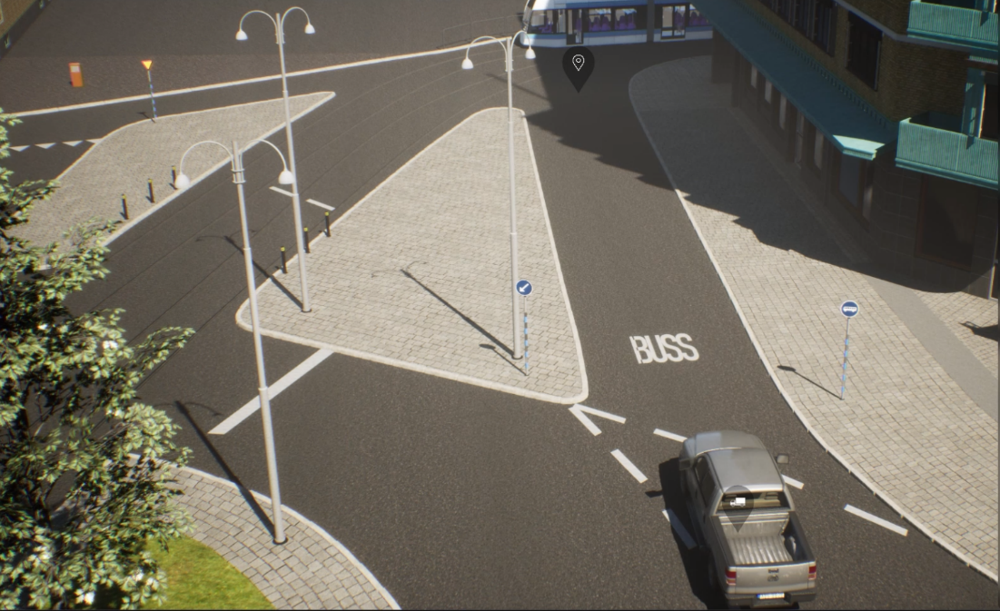
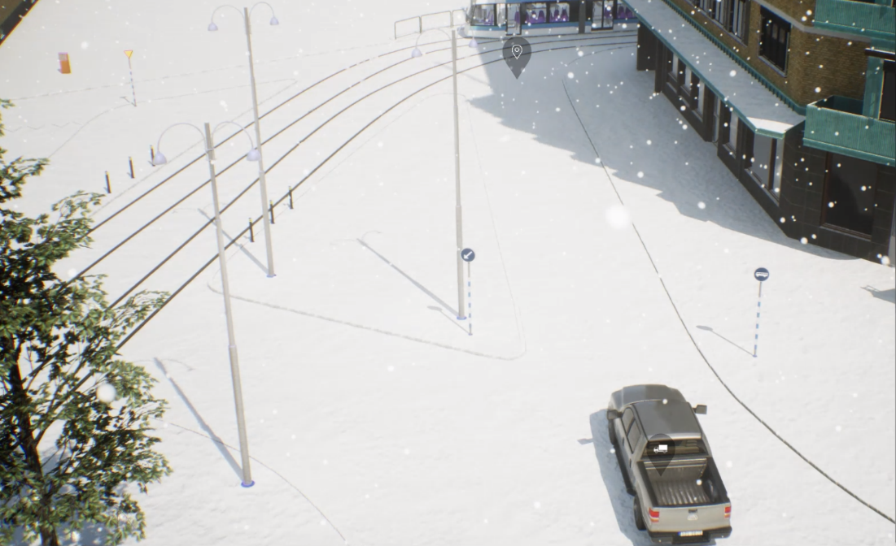
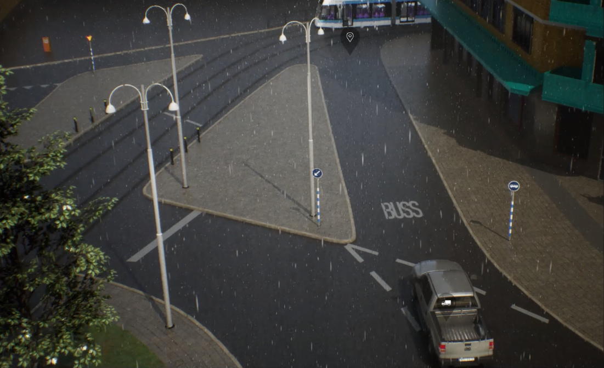

### Scenario Editor


Highway and country road scenes, Åkareplatsen resecentrum and its 3D model in BERGE simulator

## Dataset
A scenario is defined by  `scenario.JSON` and new scenarios are defined by mutating this basic scenario using noise vector `scenario_{NUM}.vec.json`.  We can run the simulator `scenarioCount` times (`NUM` < `scenarioCount`) to collect more and more data. 

Each scenario has a **VARIABLE** input parameteres which depends on complexity of the scenario.
Each scenario is played for `FrameCount` seconds and therefore there will be `FrameCount` imags from camera.
As a result we have `FrameCount` * `num_metrics` output parameters . In the postprocessing and after loading the dataset , it is possible to sum all metrics with the same type in different frames to have an overall metrics for the scenario and reduce the number of output parameters from `FrameCount` * `num_metrics` to `num_metrics`.

For each frame image we keep track of these metrics (`num_metrics` here is 4) 
- "iou": 0.7967953386744355,
- "lev": 1,
- "box_score": 0.9990084767341614,
- "ocr_score": 0.9997250437736511

Several linear regression model has to be trained to predict these metrics and find max/min of them.

### Funding 
This work is done under [VALU3S](https://valu3s.eu) project. This project has received funding from the [ECSEL](https://www.ecsel.eu) Joint Undertaking (JU) under grant agreement No 876852. The JU receives support from the European Union’s Horizon 2020 research and innovation programme and Austria, Czech Republic, Germany, Ireland, Italy, Portugal, Spain, Sweden, Turkey.

The ECSEL JU and the European Commission are not responsible for the content on this website or any use that may be made of the information it contains.


INFOTIV AB | BERGE | RISE Research Institutes of Sweden | CAMEA  | VALU3S Project
------------ |  ------------  | ------------  | ------------ | ------------ 
 | 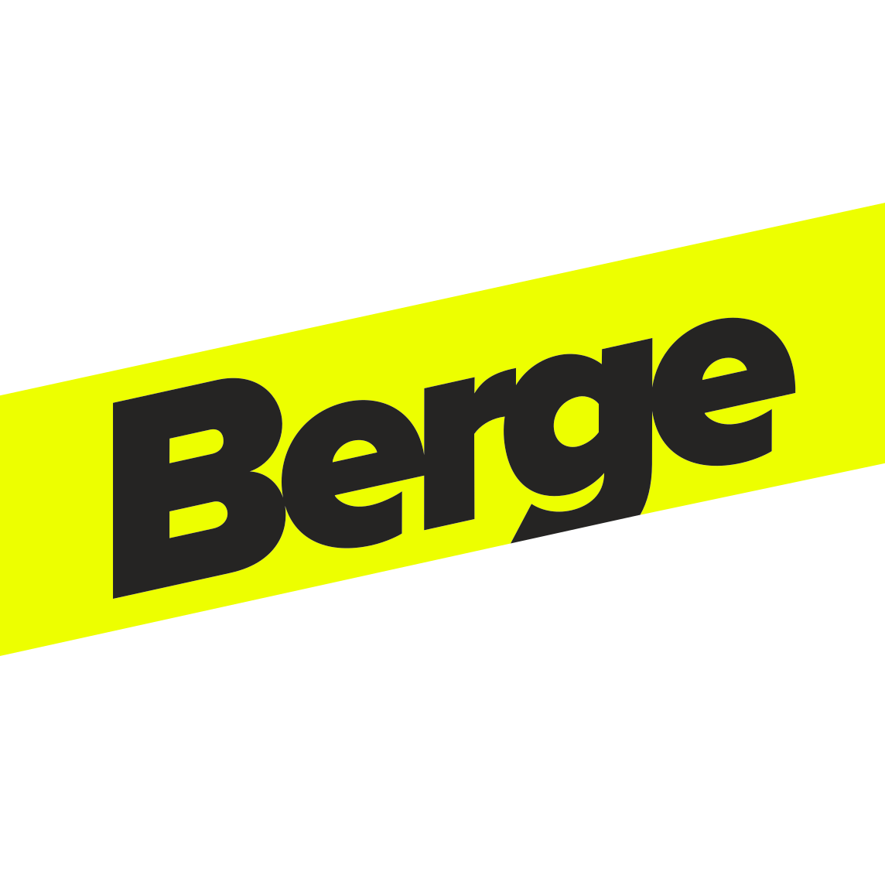  |   |  |   

This project is started and is currently maintained by [Hamid Ebadi](https://github.com/ebadi).

